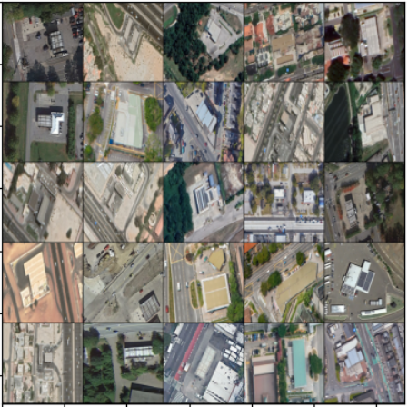

# Synthetic Data Generation for Petrol Pump Satellite Imagery with GANs and VAEs 

This repository explores various generative models, focusing on Generative Adversarial Networks (GANs) and Variational Autoencoders (VAEs), to generate realistic synthetic satellite imagery of petrol pumps. By leveraging different GAN architectures—such as Simple GAN, DCGAN, and WPGAN—along with a VAE model, the project explores the ability of generative models to expand both the diversity and volume of a dataset. These synthetic images are aimed at overcoming data scarcity, thereby improving the robustness and generalization of machine learning models trained on the augmented dataset.



The experiments conducted examine different generative model architectures, loss functions, and optimizations, aiming to identify the best approaches for stabilizing training and producing high-quality synthetic samples.

## Models Implemented
- **Simple GAN (Generative Adversarial Network):** A basic GAN model consisting of a generator and a discriminator. The generator creates synthetic images, while the discriminator classifies them as real or fake.

- **DCGAN (Deep Convolutional GAN):** An extension of GANs utilizing convolutional layers for both the generator and discriminator. 

- **WPGAN (Wasserstein GAN):** A variant of GANs designed to improve stability and convergence through the Wasserstein loss function with gradient penalty and the addition of a critic instead of a discriminator.

- **Variational Autoencoder (VAE):** A probabilistic generative model that learns a latent space for data generation, leveraging a combination of reconstruction loss and KL divergence to regularize the model.

## Key Features

- **GPU Implementation:** The models are implemented with GPU support for faster training.

- **Training Loops:** Custom training loops for each model type to ensure effective training and convergence.

- **Weights Initialization:** Proper initialization techniques to help stabilize training and avoid vanishing/exploding gradients.

- **Checkpointing:** Save and load model checkpoints during training to ensure that the model can resume from the last state in case of interruptions.

- **Visualizations:** Training progress visualizations for both the generator’s outputs and the loss curves.

### Installation

1. Clone the repository and change directory

    ```bash
    git clone https://github.com/SaniaE/gans-data-augmentation.git
    cd path/to/repo/clone
    ```
2. Create and activate a new virtual enviornment

    ```bash
    python -m venv <environment_name>
    .\<environment_name>\Scripts\activate   # For Windows
    source <environment_name>/bin/activate  # For macOS/Linux
    ```
3. Add virtual environment to the Python Kernel 

    ```bash
    python -m pip install --upgrade pip 
    pip install ipykernel 
    python -m ipykernel install --user --name=<kernel_name>
    ```
4. Install dependencies

    ```bash
    pip install -r requirements.txt
    ```
5. Launch Jupyter Notebook 

    ```bash
    jupyter notebook